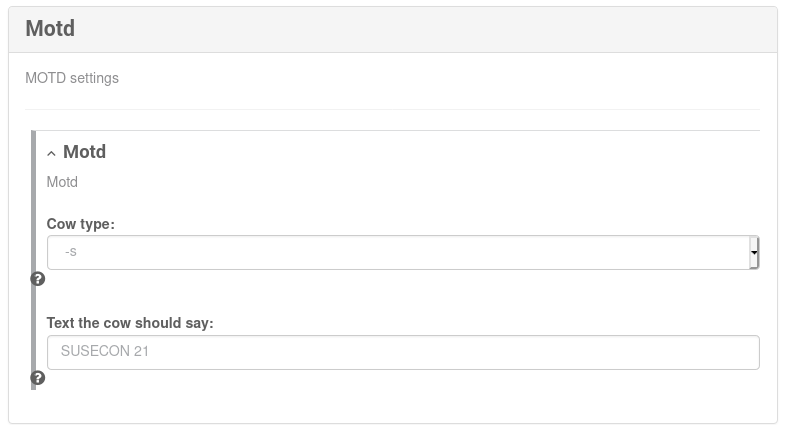

# demo-formula

Simple Salt formula for demonstrating test-driven development for SUSE Manager

## Usage

This formula... TODO

## Testing via `kitchen`

You can use [test-kitchen](https://github.com/test-kitchen/test-kitchen) to automate development and testing:

- Create instances locally or in the cloud (*VM, container*)
- Running Salt code
- Verifying acceptance criteria (*e.g. using [InSpec](https://inspec.io)*)

test-kitchen can be installed using `gem`:

```shell
# gem install kitchen kitchen-inspec kitchen-docker
```

If you want to use [Vagrant](https://vagrantup.com) machines instead of containers, you'll need to install Vagrant and the [`kitchen-vagrant`](https://rubygems.org/gems/kitchen-vagrant) package as well.

This repository's [kitchen configuration](kitchen.yml) uses Docker containers - check-out the commented out lines if you want to use virtual machines instead.

The first step is to create the instance, in this case openSUSE Leap 15.2 is used.

```shell
$ kitchen create
-----> Creating <default-opensuse-leap-152-master-py3>...
       Sending build context to Docker daemon  357.4kB
       Step 1/15 : FROM saltimages/salt-master-py3:opensuse-leap-15.2
...
-----> Test Kitchen is finished. (0m45.26s)
```

Afterwards you should be able to list the instance:

```shell
$ kitchen list
Instance                              Driver  Provisioner  Verifier  Transport  Last Action  Last Error
default-opensuse-leap-152-master-py3  Docker  SaltSolo     Inspec    Ssh        Created
```

Now run the Salt code:

```shell
$ kitchen converge
-----> Starting Test Kitchen (v2.7.2)
-----> Converging <default-opensuse-leap-152-master-py3>...
...
       Summary for local
       ------------
       Succeeded: 2 (changed=2)
       Failed:    0
       ------------
       Total states run:     2
       Total run time:  33.796 s
       Downloading files from <default-opensuse-leap-152-master-py3>
       Finished converging <default-opensuse-leap-152-master-py3> (0m43.28s).
```

Note that **2 changes** have been made. The next step is to run the unit tests:

```shell
$ kitchen verify
...
  ✔  demo-01: Package cowsay installed
     ✔  System Package cowsay is expected to be installed
  ✔  demo-02: /etc/motd updated
     ✔  File /etc/motd is expected to exist
     ✔  File /etc/motd content is expected not to == ""


Profile Summary: 2 successful controls, 0 control failures, 0 controls skipped
Test Summary: 3 successful, 0 failures, 0 skipped
```

The [acceptance criteria tests](test/demo_tests.rb) have passed.

As the testing is now completed you can remove the instance:

```shell
$ kitchen destroy
-----> Destroying <default-opensuse-leap-152-master-py3>...
...
-----> Test Kitchen is finished. (0m2.78s)
```

## Using in SUSE Manager

Create state and metadata folders for the formula (`demo`):

```shell
# mkdir /usr/share/susemanager/formulas/{metadata,states}/demo
```

Copy metadata information and states:

```shell
# cp metadata/* /usr/share/susemanager/formulas/metadata/demo/
# cp demo/init.sls /usr/share/susemanager/formulas/states/demo/
```

You will now find a new Salt Formula when configuring hosts. Enable it, click "*Save*" and you will see a new pane where you can set Pillar information:



Try applying the high state and login to the system via SSH - you should see a new login message:

```shell
$ ssh giertz@pinkepank
...
 ____________ 
< SUSECON 21 >
 ------------ 
        \   ^__^
         \  (**)\_______
            (__)\       )\/\
             U  ||----w |
                ||     ||
```

## Building a RPM package

An easier way of distribution is to ship RPM packages.
You will need an openSUSE or SLES machine and install some development packages:

```shell
# zypper in -y tar gzip rpmdevtools rpm-build git
```

If not already done, clone this git repository. Also, rename the folder and create a tarball for the specific version:

```shell
$ git clone https://github.com/stdevel/demo-formula.git
$ mv demo-formula demo-formula-1.0
$ mkdir -p ~/rpmbuild/SOURCES
$ tar cvfz ~/rpmbuild/SOURCES/demo-formula-1.0.tar.gz demo-formula-1.0
```

Now create release and source RPM packages:

```shell
$ rpmbuild -ba demo-formula-1.0/demo-formula.spec
```

In the `rpmbuild/RPMS` folder you will find a RPM package that can be installed easily on SUSE Manager or Uyuni.
